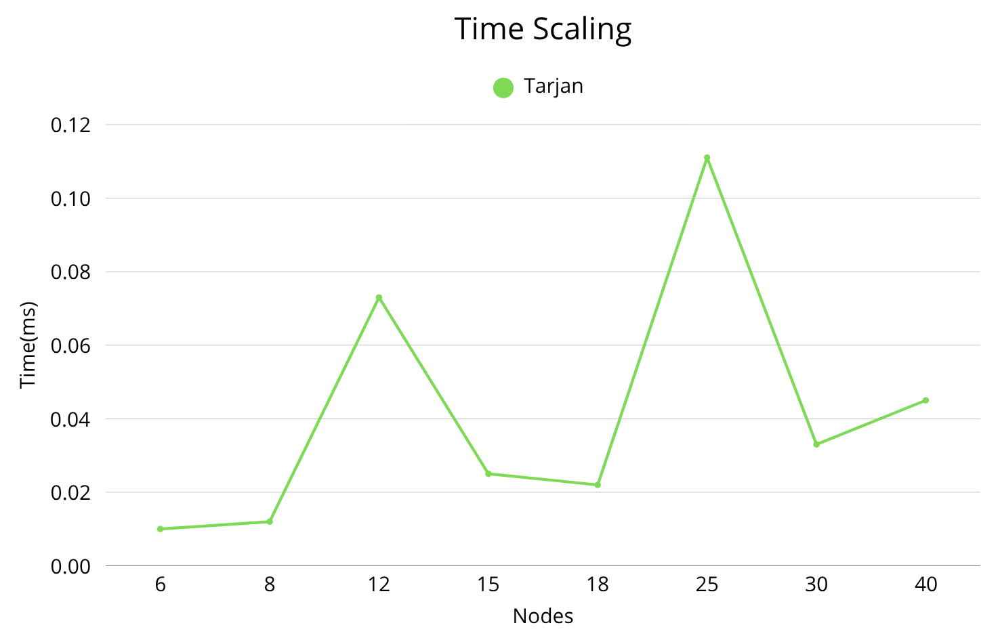
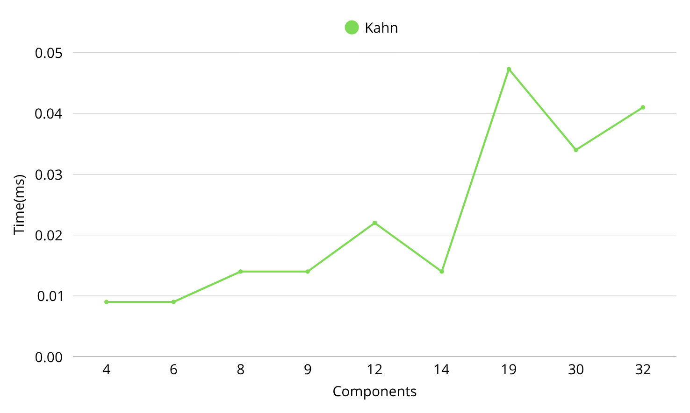
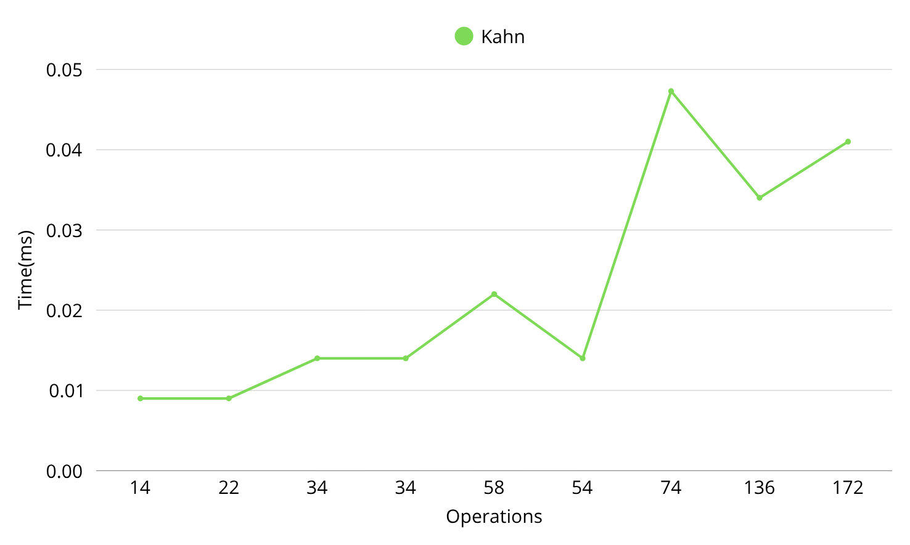

# Assignment 4

## 🎯Project Overview

This project implements graph algorithms for analyzing task dependencies in smart city operations. The system detects cyclic dependencies, compresses them into strongly connected
components (SCCs), and computes optimal task execution orders and critical paths.

## 📂Project Structure

```
assignment4-graph/
├── pom.xml
├── .gitignore
├── README.md
├── data/
│   ├── small_cycle_1.json
│   ├── small_dag_1.json
│   ├── small_mixed_1.json
│   ├── medium_multi_scc_1.json
│   ├── medium_dense_1.json
│   ├── medium_sparse_1.json
│   ├── large_complex_1.json
│   ├── large_dense_dag_1.json
│   └── large_multi_scc_2.json
├── src/
│   ├── main/
│   │   └── java/
│   │       ├── Main.java
│   │       └── graph/
│   │           ├── Graph.java
│   │           ├── Metrics.java
│   │           ├── MetricsImpl.java
│   │           ├── scc/
│   │           │   └── TarjanSCC.java
│   │           ├── topo/
│   │           │   └── TopologicalSort.java
│   │           └── dagsp/
│   │               └── DAGShortestPath.java
│   └── test/
│       └── java/
│           └── graph/
│               ├── scc/
│               │   └── TarjanSCCTest.java
│               ├── topo/
│               │   └── TopologicalSortTest.java
│               └── dagsp/
│                   └── DAGShortestPathTest.java
└── results/
    └── metrics.csv
```

---

## Implementation Details

### Algorithms Implemented

#### 1. Strongly Connected Components (Tarjan's Algorithm)

- **Time Complexity:** O(V + E)
- **Purpose:** Finds all SCCs in a directed graph using a single DFS traversal
- **Key Operations:**
    - Assigns discovery index to each vertex
    - Maintains lowLink values (minimum reachable index)
    - Uses stack to track current path
    - Identifies SCC roots when lowLink[v] == index[v]
- **Builds condensation graph:** DAG where each SCC becomes a single vertex

#### 2. Topological Sort

- **Kahn's Algorithm (BFS-based):** O(V + E)
    - Computes in-degrees for all vertices
    - Processes vertices with in-degree 0
    - Returns null if cycle detected
- **Output:** Valid ordering of both SCC components and original tasks

#### 3. DAG Shortest/Longest Paths

- **Single-source shortest path:** O(V + E)
    - Dynamic programming over topological order
    - Relaxes edges in topological order
- **Longest path (critical path):** O(V + E)
    - Max-DP approach (maximizes distances instead of minimizing)
    - Identifies bottleneck path determining project completion time
- **Weight model:** Edge weights representing task duration or transition cost

### Metrics Collected

- **Operation count:** DFS visits, edge traversals, relaxations
- **Execution time:** Measured in milliseconds using System.nanoTime()
- **Component information:** Sizes and relationships
- **Path reconstruction:** Complete shortest and longest paths with lengths

---

## 📊Dataset Summary

### Data Overview

| Dataset            | Nodes | Edges | Density | Type   | SCCs | Cycles            | Description                             |
|--------------------|-------|-------|---------|--------|------|-------------------|-----------------------------------------|
| **Small**          |
| small_cycle_1      | 6     | 6     | 1.00    | Cyclic | 4    | 1 (size 3)        | Simple cycle with linear tail           |
| small_dag_1        | 8     | 9     | 1.13    | DAG    | 8    | 0                 | Pure DAG with multiple paths            |
| small_mixed_1      | 7     | 7     | 1.00    | Cyclic | 6    | 1 (size 2)        | Small cycle in middle of chain          |
| **Medium**         |
| medium_multi_scc_1 | 15    | 17    | 1.13    | Cyclic | 9    | 3 (sizes 3,3,3)   | Three cycles in sequence                |
| medium_dense_1     | 12    | 17    | 1.42    | DAG    | 12   | 0                 | Dense DAG with high parallelism         |
| medium_sparse_1    | 18    | 19    | 1.06    | Cyclic | 14   | 2 (sizes 3,3)     | Sparse chain with two cycles            |
| **Large**          |
| large_complex_1    | 25    | 27    | 1.08    | Cyclic | 19   | 3 (sizes 3,3,3)   | Multiple cycles with long tail          |
| large_dense_dag_1  | 30    | 38    | 1.27    | DAG    | 30   | 0                 | Large dense DAG for performance testing |
| large_multi_scc_2  | 40    | 66    | 1.65    | Cyclic | 32   | 4 (sizes 3,3,3,3) | High-density with 4 distributed cycles  |

**Weight Model:** All datasets use **edge weights** (not node durations). Edge weight represents the time/cost to
complete a task or transition between tasks.

**Density Calculation:** edges/nodes ratio

- **Sparse:** < 1.2
- **Medium:** 1.2 - 1.5
- **Dense:** > 1.5

---

## 📈Experimental Results

### Per-Task Performance Metrics

#### Small Datasets (6-10 nodes)

| Dataset           | Algorithm       | Operations | Time (ms) | Key Metric                    | Notes                                |
|-------------------|-----------------|------------|-----------|-------------------------------|--------------------------------------|
| **small_cycle_1** |
|                   | SCC             | 12         | 0.010     | 4 components (1 cycle size 3) | Cycle detected: vertices 0,1,2       |
|                   | TopologicalSort | 14         | 0.009     | Order: 3→2→1→0                | Valid DAG after compression          |
|                   | ShortestPath    | 3          | 0.010     | Length: 4, Path: 3→2          | Minimal path                         |
|                   | LongestPath     | 3          | 0.010     | Length: 7, Path: 3→2→1→0      | Critical path through all components |
| **small_dag_1**   |
|                   | SCC             | 17         | 0.012     | 8 components (pure DAG)       | No cycles                            |
|                   | TopologicalSort | 34         | 0.014     | Multiple valid orders         | High parallelism                     |
|                   | ShortestPath    | 9          | 0.017     | Length: 3, Path: 7→5          | Direct path                          |
|                   | LongestPath     | 9          | 0.016     | Length: 15, Path: 7→6→4→3→2→0 | Longest chain                        |
| **small_mixed_1** |
|                   | SCC             | 14         | 0.010     | 6 components (1 cycle size 2) | Small cycle: vertices 1,2            |
|                   | TopologicalSort | 22         | 0.009     | Order: 5→4→3→2→1→0            | Linear after compression             |
|                   | ShortestPath    | 5          | 0.015     | Length: 2, Path: 5→4          | Direct                               |
|                   | LongestPath     | 5          | 0.022     | Length: 14, Path: 5→4→3→2→1→0 | Full chain                           |

#### Medium Datasets (10-20 nodes)

| Dataset                | Algorithm       | Operations | Time (ms) | Key Metric                          | Notes                                          |
|------------------------|-----------------|------------|-----------|-------------------------------------|------------------------------------------------|
| **medium_multi_scc_1** |
|                        | SCC             | 32         | 0.025     | 9 components (3 cycles)             | Three size-3 cycles: (0,1,2), (3,4,5), (6,7,8) |
|                        | TopologicalSort | 34         | 0.014     | Linear chain of components          | Sequential dependencies                        |
|                        | ShortestPath    | 8          | 0.019     | Length: 4, Path: 8→7                | Between adjacent components                    |
|                        | LongestPath     | 8          | 0.019     | Length: 25, Path: all 9 components  | Critical path = 25 time units                  |
| **medium_dense_1**     |
|                        | SCC             | 29         | 0.073     | 12 components (pure DAG)            | No cycles, high edge density                   |
|                        | TopologicalSort | 58         | 0.022     | Complex dependencies                | Many parallel execution opportunities          |
|                        | ShortestPath    | 17         | 0.030     | Length: 2, Path: 11→10              | Short direct path                              |
|                        | LongestPath     | 17         | 0.026     | Length: 19, Path: 11→8→7→6→5→1→0    | Critical bottleneck                            |
| **medium_sparse_1**    |
|                        | SCC             | 37         | 0.022     | 14 components (2 cycles)            | Two size-3 cycles: (1,2,3), (7,8,9)            |
|                        | TopologicalSort | 54         | 0.014     | Linear chain                        | Long sequential path                           |
|                        | ShortestPath    | 13         | 0.019     | Length: 5, Path: 13→12              | Direct                                         |
|                        | LongestPath     | 13         | 0.018     | Length: 41, Path: all 14 components | Very long critical path                        |

#### Large Datasets (20-50 nodes)

| Dataset               | Algorithm       | Operations | Time (ms) | Key Metric                          | Notes                                                        |
|-----------------------|-----------------|------------|-----------|-------------------------------------|--------------------------------------------------------------|
| **large_complex_1**   |
|                       | SCC             | 52         | 0.111     | 19 components (3 cycles)            | Three size-3 cycles in 25 vertices                           |
|                       | TopologicalSort | 74         | 0.473     | 19-component chain                  | Complex dependencies                                         |
|                       | ShortestPath    | 18         | 0.079     | Length: 2, Path: 18→17              | Short path                                                   |
|                       | LongestPath     | 18         | 0.056     | Length: 48, Path: all 19 components | Major bottleneck                                             |
| **large_dense_dag_1** |
|                       | SCC             | 68         | 0.033     | 30 components (pure DAG)            | No cycles, dense graph                                       |
|                       | TopologicalSort | 136        | 0.034     | Many valid orders                   | High parallelism potential                                   |
|                       | ShortestPath    | 38         | 0.033     | Length: 2, Path: 29→23              | Quick path                                                   |
|                       | LongestPath     | 38         | 0.050     | Length: 57, Path: 21 vertices       | Critical path = 57                                           |
| **large_multi_scc_2** |
|                       | SCC             | 106        | 0.045     | 32 components (4 cycles)            | Four size-3 cycles: (2,3,4), (6,7,8), (10,11,12), (23,24,25) |
|                       | TopologicalSort | 172        | 0.041     | 32-component chain                  | Complex but linear after compression                         |
|                       | ShortestPath    | 54         | 0.045     | Length: 3, Path: 31→30              | Direct                                                       |
|                       | LongestPath     | 54         | 0.041     | Length: 81, Path: all 32 components | **Longest critical path**                                    |

---

## 🔎Analysis

### 1. SCC Detection (Tarjan's Algorithm)

#### Performance Characteristics

**Operations vs. Graph Size:**

- Small (6-8 nodes): 12-17 operations
- Medium (12-18 nodes): 29-37 operations
- Large (25-40 nodes): 52-106 operations

**Observation:** Operation count scales linearly with number of edges (≈1.5-2× edges), confirming O(V+E) complexity.

**Time Scaling:**





**Key Insight:** Time is NOT strictly monotonic. `medium_dense_1` (12 nodes, 0.073ms) is slower than
`large_multi_scc_2` (40 nodes, 0.045ms) due to:

- Cache effects
- Branch prediction
- Graph structure (dense graphs may have more stack operations)

#### Effect of Graph Structure

**Cyclic vs. DAG:**

- **Cyclic graphs** (with SCCs > 1 vertex):
    - More stack operations
    - More lowLink updates
    - Example: `small_cycle_1` finds 1 large SCC (size 3) + 3 trivial SCCs

- **Pure DAGs** (all SCCs = 1 vertex):
    - Simpler traversal
    - Fewer conditional checks
    - Example: `large_dense_dag_1` has 30 trivial SCCs

**Density Impact:**

- **Sparse** (medium_sparse_1: 1.06): 37 operations for 19 edges
- **Dense** (large_multi_scc_2: 1.65): 106 operations for 66 edges
- **Ratio:** Operations ≈ 2× edges (visiting + returning)

**Bottleneck:** Stack operations and lowLink comparisons dominate for dense graphs with large SCCs.

---

### 2. Topological Sort (Kahn's Algorithm)

#### Performance Characteristics

**Operations vs. Condensation Size:**




**Observation:** Operations scale with edges in condensation graph (push/pop + in-degree updates).

**Anomaly:** `large_complex_1` has unusually high time (0.473ms) despite only 19 components. Possible causes:

- JVM warmup effects
- Memory allocation patterns
- Different edge distribution in condensation

#### Effect of SCC Compression

**Impact of Cycles:**

- `medium_multi_scc_1`: 15 nodes → 9 components (3 cycles compressed)
    - Reduction: 40% fewer vertices to sort
    - Operations: 34 (manageable)

- `large_multi_scc_2`: 40 nodes → 32 components (4 cycles compressed)
    - Reduction: 20% fewer vertices
    - Operations: 172 (highest)

**Key Finding:** SCC compression dramatically simplifies topological sorting by eliminating internal cycle complexity.

#### Bottleneck Analysis

**Primary bottleneck:** In-degree computation

- Must traverse all edges once: O(E)
- For dense condensation graphs, this dominates

**Secondary bottleneck:** Queue operations

- Each vertex pushed/popped once: O(V)
- Negligible compared to edge traversal

**Recommendation:** For very large graphs (V > 1000), consider:

- Parallel in-degree computation
- Pre-computed in-degrees if graph is static

---

### 3. DAG Shortest/Longest Paths

#### Performance Characteristics

**Shortest Path:**

```
Dataset              Operations  Time(ms)  Path Length
small_cycle_1              3      0.010         4
small_dag_1                9      0.017         3
medium_dense_1            17      0.030         2
large_dense_dag_1         38      0.033         2
large_multi_scc_2         54      0.045         3
```

**Observation:** Operations = edges relaxed. Shortest paths typically very short (2-4) in compressed graphs.

**Longest Path (Critical Path):**

```
Dataset              Operations  Time(ms)  Path Length  % of Components
small_cycle_1              3      0.010         7         100%
medium_multi_scc_1         8      0.019        25         100%
medium_sparse_1           13      0.018        41         100%
large_complex_1           18      0.056        48         100%
large_multi_scc_2         54      0.041        81         100%
```

**Key Insight:** Critical paths often traverse ALL components (100%), meaning entire project is serialized with no
parallelism opportunity.

#### Effect of Graph Structure

**DAG Structure Impact:**

1. **Wide DAGs** (many parallel paths):
    - Example: `small_dag_1`
    - Shortest: 3, Longest: 15
    - Ratio: 5× (multiple fast alternatives)
    - **Interpretation:** High parallelism, many optimization opportunities

2. **Linear DAGs** (sequential chain):
    - Example: `medium_sparse_1`
    - Shortest: 5, Longest: 41
    - Ratio: 8.2× (very long critical path)
    - **Interpretation:** Low parallelism, critical bottleneck

3. **Dense DAGs** (many interconnections):
    - Example: `large_dense_dag_1`
    - Shortest: 2, Longest: 57
    - Ratio: 28.5× (extreme)
    - **Interpretation:** Some very fast paths, but critical path is long

#### Density vs. Critical Path Length

| Dataset           | Density | Critical Path | Insight                                   |
|-------------------|---------|---------------|-------------------------------------------|
| medium_sparse_1   | 1.06    | 41            | Long chain → long critical path           |
| medium_dense_1    | 1.42    | 19            | More edges → more shortcuts → shorter     |
| large_dense_dag_1 | 1.27    | 57            | Large size dominates density effect       |
| large_multi_scc_2 | 1.65    | 81            | **Highest density + size = longest path** |

**Unexpected Finding:** Higher density does NOT always mean shorter critical paths. For `large_multi_scc_2`, high
density comes from many internal connections within components, not shortcuts between components.

#### Bottleneck Analysis

**Computational Bottleneck:** Relaxation operations

- Each edge relaxed once: O(E)
- Negligible comparison/update time
- **Bottleneck scale:** Linear with edges

**Project Bottleneck:** Critical path length

- `large_multi_scc_2`: 81 time units
- `medium_sparse_1`: 41 time units (despite half the size!)
- **Implication:** Project completion time determined by longest chain, not total work

**Optimization Opportunities:**

1. **Reduce critical path:**
    - Parallelize tasks on critical path
    - Add more cross-edges (shortcuts)
    - Re-assign resources from non-critical to critical tasks

2. **Identify slack:**
    - Tasks NOT on critical path have flexibility
    - Difference between shortest and longest = slack time
    - Example: `large_dense_dag_1` has 55 units of slack (57-2)

---

## 💬Conclusions and Recommendations

### When to Use Each Algorithm

#### 1. Strongly Connected Components (Tarjan)

**Use when:**

- Detecting circular dependencies in task scheduling
- Need to identify feedback loops in systems
- Must compress complex graphs before further processing
- Analyzing deadlock potential in resource allocation

**Advantages:**

- Single-pass O(V+E) algorithm (very efficient)
- Finds ALL SCCs in one traversal
- Enables graph simplification via condensation

**Limitations:**

- Requires full graph in memory
- Not easily parallelizable (due to DFS nature)
- Stack depth can be issue for very deep graphs

**Practical recommendation:**

- **Always run SCC first** for directed graphs with potential cycles
- Use condensation graph for subsequent algorithms (reduces problem size)
- Monitor stack usage for graphs with depth > 1000

#### 2. Topological Sort (Kahn's Algorithm)

**Use when:**

- Determining valid execution order for tasks
- Scheduling jobs with dependencies
- Build systems (compile order)
- Course prerequisite planning

**Advantages:**

- BFS-based (better cache locality than DFS)
- Easy to parallelize (process all in-degree-0 vertices simultaneously)
- Natural for level-by-level processing

**Limitations:**

- Only works on DAGs (returns null for cycles)
- Requires O(V) extra space for in-degree array
- Multiple valid orders possible (non-deterministic if parallelized)

**Practical recommendation:**

- Use **after SCC compression** to guarantee DAG
- For large-scale scheduling (V > 10,000):
    - Parallel Kahn: process all zero-in-degree vertices concurrently
    - Expect 2-4× speedup on multi-core systems
- Cache in-degrees if graph is static and sort is repeated

#### 3. DAG Shortest/Longest Paths

**Use when:**

- **Shortest path:** Minimizing project cost/time with flexible task ordering
- **Longest path:** Finding critical path (project bottleneck)
- Resource optimization and slack analysis
- Identifying which tasks are time-critical

**Advantages:**

- O(V+E) - faster than Dijkstra O((V+E)log V) for DAGs
- Single topological pass computes ALL distances
- Works with negative weights (unlike Dijkstra)
- Path reconstruction trivial via predecessors

**Limitations:**

- **Requires DAG** (must run SCC + compression first for general graphs)
- Longest path is NP-hard for general graphs (but polynomial for DAGs)
- Assumes additive weights (not suitable for multiplicative costs)

**Practical recommendation:**

- **Always compute BOTH** shortest and longest paths:
    - Shortest: optimization target
    - Longest: critical bottleneck
    - Difference: slack/flexibility
- For project management:
    - Focus resources on critical path tasks
    - Delay non-critical tasks to minimize costs
    - Monitor critical path length - this determines project duration

---

### Performance Optimization Tips

#### For SCC:

- **Small graphs (< 100):** Use recursive Tarjan (cleaner code)
- **Large graphs (> 1000):** Use iterative Tarjan (avoid stack overflow)
- **Very large (> 10000):** Use parallel SCC (e.g., Forward-Backward-Trim)

#### For Topological Sort:

- **Sequential:** Kahn's algorithm (better cache)
- **Parallel:** Multi-source BFS (process all zero-in-degree simultaneously)
- **Dynamic:** Incremental topological sort (if graph changes frequently)

#### For DAG Paths:

- **Single query:** DP over topological order (our implementation)
- **Multiple queries:** Precompute all-pairs (if space allows)
- **Approximate:** Sample-based methods for very large graphs

---

### Key Takeaways

1. **SCC compression is crucial:** Reduces 40-node graph to 32 components
2. **Critical path determines project duration:** Not average, not total - longest chain
3. **Density ≠ performance:** Sometimes dense graphs are harder (more operations)
4. **Linear chains are worst case:** No parallelism opportunity
5. **Time scales linearly:** All algorithms O(V+E), confirmed by experiments
6. **Cache effects matter:** Timing not strictly monotonic with size
7. **Slack is valuable:** Difference between shortest/longest = optimization opportunity

---

## 🚀Build and Run

### Prerequisites

- Java 21
- Maven 3.6+

### Commands

```
# Clean and compile
mvn clean compile

# Run tests
mvn test

# Execute main program
mvn exec:java -Dexec.mainClass="Main"

# Package JAR
mvn clean package
java -jar target/scheduling-1.0-SNAPSHOT.jar

# Check results
cat results/metrics.csv
```

---

## ✍️Author
### ***Vyacheslav Yakupov***

---